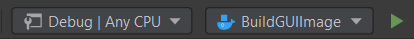
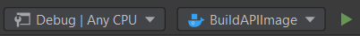
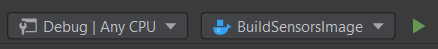
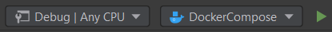

# GreenHouse
Project for Si.NET classes at Gdansk University of Technology

[![MIT licensed][shield-mit]](LICENSE)
[![.NET v5.0][shield-.net]](https://docs.microsoft.com/en-us/dotnet/core/dotnet-five)
[![ASP.NET][shield-asp.net]](https://dotnet.microsoft.com/apps/aspnet)

## Description
Solution has 3 projects: Sensors, API and GUI. 

Sensors project is responsible for generating data and inserting it into the rabbitMQ bus.
Project exposes endpoint to control data generating process.

API project is responsible for getting data out of the rabbitMQ bus and inserting it to the database. 
Project also exposes endpoints do get data with filtering, sorting and pagination. 
There are two available endpoints; one for getting the data and the second one for getting the sensors data in specified format. 
API handles two formats: Json and CSV.

GUI project is responsible for displaying sensors data in table. 
GUI projects takes data from the API endpoints.
Data can be sorted, filtered
and exported to files. GUI project also generates graph from the filtered data.

Examples of http request for
Sensors and API projects are available in requests.http in projects directories. 

## Requirements

The list of tools required to build and run the project:

* Docker Engine 19.03.0+

## Building

In order to build docker images use:

```bash
docker build --tag si_160132_gui_img ./GUI
docker build --tag si_160132_api_img ./API
docker build --tag si_160132_data_generator_img ./Sensors
```

In order to build docker images in Rider use:




## Running

In order to run using Docker use (+uses running mongodb container):

```bash
docker-compose up
```

In order to run in Rider for development use:



For development of any application layer stop specific container and run specific project instead of it.


## License

Project is licensed under the [MIT](LICENSE) license.

## Contributors

Copyright &copy; 2021, [kingapili] & [wojwenc] & [michalguzik96] & [Bartek577777]


[shield-mit]: https://img.shields.io/badge/license-MIT-blue.svg
[shield-asp.net]: https://img.shields.io/badge/ASP.NET-blue.svg
[shield-.net]: https://img.shields.io/badge/.NET-5.0-blue.svg
[kingapili]: https://github.com/kingapili
[wojwenc]: https://github.com/wojwenc
[michalguzik96]: https://github.com/michalguzik96
[Bartek577777]: https://github.com/Bartek577777
